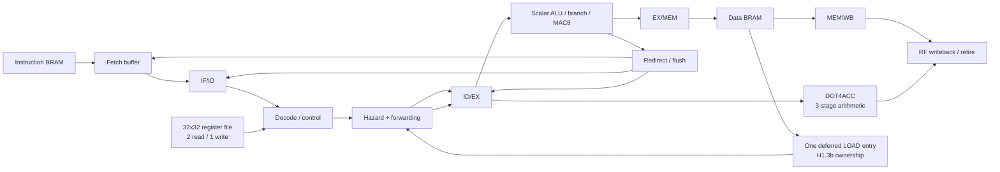

# Final CPU Architecture Specification

## 1. Frozen reference

The finished processor is the H1.3b functional architecture implemented by
`rtl/cpu_core_pipeline_dot4acc_memopt_h13b_timingopt_t2.sv`, module
`cpu_core_pipeline_dot4acc_memopt_h13b_timingopt_t2`. The Basys 3 shell is
`rtl/fpga_top_pipeline_dot4acc_memopt_h13b_timingopt_t2.sv`, module
`fpga_top_pipeline_dot4acc_memopt_h13b_timingopt_t2`. The board constraint is
`constraints/basys3.xdc`, target `xc7a35tcpg236-1`, clocked by the constrained
Basys 3 system clock. T2 is a timing-equivalent implementation of H1.3b:
its functional change is the T2 separation of branch operands from the
DOT-only deferred-load forwarding mux; it does not change scheduling or ISA
semantics.

## 2. ISA

All instructions are 32 bits: `[31:28] opcode`, `[27:23] rd`, `[22:18] rs1`,
`[17:13] rs2`, and signed `[12:0] imm13`. There are 32 32-bit registers,
`x0` is hardwired to zero.

| Opcode | Instruction | Operation |
|---|---|---|
| 0 | NOP | no architectural effect |
| 1 | ADD | `rd = rs1 + rs2` |
| 2 | SUB | `rd = rs1 - rs2` |
| 3 | AND | bitwise AND |
| 4 | OR | bitwise OR |
| 5 | XOR | bitwise XOR |
| 6 | ADDI | `rd = rs1 + signext(imm13)` |
| 7 | LOAD | `rd = data[rs1 + signext(imm13)]` |
| 8 | STORE | `data[rs1 + signext(imm13)] = rs2` |
| 9 | BEQ | PC-relative branch when `rs1 == rs2` |
| A | JUMP | unconditional PC-relative jump |
| B | MAC8 | `rd += signed8(rs1[7:0])*signed8(rs2[7:0])` |
| C | DOT4ACC | four-lane signed-int8 accumulate |

BEQ/JUMP targets are `pc + (signext(imm13) << 2)`. DOT4ACC and MAC8 require
canonical zero reserved bits in the final encoding.

## 3. Register and memory architecture

The register file has 32 entries × 32 bits, two combinational read values and
one architectural write port. Instruction and data memories are synchronous
single-port BRAM-style arrays of 256 × 32 bits. Addressing is byte-addressed,
with word selection from `addr[9:2]`; aligned word accesses are the defined
use. DOT words are packed lane 0 in `[7:0]`, lane 1 in `[15:8]`, lane 2 in
`[23:16]`, and lane 3 in `[31:24]`. The 256-word instruction capacity is why
the Stage J application used a 2×64 matrix-vector program rather than a fully
unrolled 4×128 program.

## 4. Pipeline

The scalar path is a five-boundary pipeline:

```text
Instruction BRAM -> fetch buffer -> IF/ID -> ID/EX -> EX/MEM -> MEM/WB -> retire/RF
                                      |         |          |
                                   decode   ALU/branch   data BRAM
```

`id_ex_reg_t` carries PC, instruction fields, operands, accumulator, and
control. `ex_mem_reg_t` carries ALU result/store data and memory controls;
`mem_wb_reg_t` carries completion metadata. Valid bits gate all architectural
effects. Fetch buffering and `redirect_pending_valid` preserve synchronous
instruction-BRAM timing.

DOT4ACC has its own three advancing arithmetic registers (`dot_issue_reg`,
two metadata stages, and completion metadata aligned to the arithmetic pipe).
An accepted DOT at issue edge `I` completes at `I+3` and retires/writes back at
`I+4`. The arithmetic unit accepts a new operation every enabled cycle; the
same-rd chain therefore remains II=1. MAC8 is a scalar EX multiply-add using
the low signed byte of each source and the full 32-bit accumulator.

## 5. Hazards and forwarding

Scalar decode forwards the current MEM/WB result and inserts a load-use bubble
when ID/EX contains a load whose destination is consumed by the younger
instruction. EX operands select the youngest available normal producer in
this order: EX/MEM ALU result, then MEM/WB writeback. DOT operands additionally
observe a completed DOT result and, only for DOT rs1/rs2, the H1.2 deferred
LOAD value. DOT pre-completion and accumulator dependencies hold issue; a
same-rd continuation uses the chain accumulator path. MAC8 has a dedicated
low-byte operand-A selection and normal scalar forwarding.

T2 gives branches a separate operand mux (EX/MEM, MEM/WB, and completed DOT),
and conservatively prevents a branch from reaching EX while a deferred LOAD
is active. Thus branch control does not pay the DOT-only deferred-data mux
cone. Stores use forwarded base/data operands. Redirects flush younger fetch,
IF/ID, and ID/EX work; pending redirects prevent wrong-path issue and
retirement.

## 6. Stage H memory-feed mechanism

H0's repeated `LOAD, LOAD, DOT` pattern measured `9K+6` cycles. H1.1 allowed
one younger LOAD to overlap an older DOT but deferred retirement serialization
erased the cycle savings. H1.2 added read-only deferred LOAD forwarding to
DOT rs1/rs2, but the original schedule did not reach a dependent DOT early
enough. H1.3a proved ID/EX was a safe pre-completion holding point, but admitted
zero second LOADs.

H1.3b adds the atomic `second_load_transfer_fire` event. It admits exactly one
qualifying second LOAD from IF/ID into ID/EX, tracking both
`second_load_reserved` (dynamic instruction outstanding) and
`second_load_idex_owned` (held transaction). While the one-entry
`deferred_load_valid` slot is occupied, LOAD B remains stable in ID/EX: it does
not enter EX/MEM, launch BRAM, complete, write back, or retire. Once the entry
drains it transfers once through EX/MEM and completes normally. Destination
conflicts, base dependencies, redirects, and a third LOAD remain blocked.

For N=128 there are 31 legal pair transitions, giving exactly 31 admissions,
31 EX/MEM transfers, 31 BRAM reads and 31 completions with no duplicate or
lost completion. The measured model is `8K+7`, and the kernel is 263 cycles.
Retirement remains in program order; operand availability may precede
architectural retirement, but no instruction overtakes an older instruction.

## 7. Control-flow and cancellation

BEQ compares selected branch operands in EX; JUMP may redirect from the
front-end path when eligible. EX redirects have priority over younger issue,
and `redirect_pending_valid` holds the target until fetch can safely consume
it. `dot_cancel_event` cancels younger DOT state on a redirect. Valid bits,
ownership state, deferred metadata, and pipeline controls are reset together,
so wrong-path LOAD/DOT work cannot write registers, memory, or retirement.

## 8. Final architecture diagram



## 9. Representative timing

| Operation | Enabled-edge behaviour |
|---|---|
| Scalar ALU | decode → ID/EX → EX/MEM ALU → MEM/WB/RF retirement |
| LOAD → consumer | synchronous BRAM response; one load-use bubble before consumer EX |
| MAC8 | scalar EX multiply-add, then normal MEM/WB retirement |
| Isolated DOT | issue `I`, arithmetic completion `I+3`, retirement/WB `I+4` |
| Same-rd DOT | issue at `I`, `I+1`, …; chain accumulator forwarding, II=1 |
| Stage H pair | older DOT active → LOAD A overlap/deferred → LOAD B admitted → DOT; one deferred entry and in-order retirement |
| Redirect | taken EX/JUMP redirect wins; younger fetch/IF/ID/ID/EX work is invalidated |

## 10. Final physical characteristics

Target is Basys 3 `xc7a35tcpg236-1`, Vivado 2026.1. The highest repeatably
validated frequency is 93 MHz, PASS 5/5. The nearest tested higher point is
94 MHz and fails with WNS -0.257 ns and 118 setup failures; 100 MHz is not
closed. At 93 MHz: WNS +0.230 ns, TNS 0, hold WNS +0.059 ns, LUT 2008,
FF 1812, RAMB18 2, DSP48 5, BUFG 1, latches 0.

The representative limiting setup family is data BRAM clock-to-output through
forwarding/operand selection and DOT/control logic into an ID/EX operand reset
endpoint: `cpu_inst/data_mem_inst/mem_reg/CLKARDCLK` →
`cpu_inst/id_ex_reg_reg[operand_b][16]/R`, 9.878 ns data delay (4.651 ns
logic, 5.227 ns routing, 12 levels). The worst hold path is
`cpu_inst/ex_mem_reg_reg[store_data][0]/C` →
`cpu_inst/data_mem_inst/mem_reg/DIADI[0]`, +0.059 ns.

## 11. Performance hierarchy

| Level | Result |
|---|---|
| Register-resident DOT | N=128: 43 cycles; same-rd II=1 |
| Memory-fed kernel | N=128: 263 cycles; 45.26 MMAC/s @93 MHz |
| Complete J1 program | N=128: 358 cycles; 33.2514 MMAC/s |
| Complete J2 program | 2×64: 331 cycles; 35.9637 MMAC/s |

The progression reflects increasing memory, pointer, store, fill/drain, and
program-control work rather than a change in DOT arithmetic.

## 12. Decisions and limitations

Accepted: four-lane pipelined DOT4ACC, same-rd II=1, one-entry deferred LOAD,
selective second-LOAD admission, one RF write port, T2 branch/deferred-forward
separation, and the 93 MHz validated operating point.

Rejected/no-go: H1.1/H1.2/H1.3a as performance candidates, T3 valid-only
flush timing recovery (functionally safe but physically worse), T4 (structural
equivalence not proven), and Stage I scalar/DOT overlap (realistic benefit too
small for its timing/control risk). A fully unrolled Stage J 4×128 workload
was rejected by the 256-word instruction-memory capacity; 2×64 was measured.

Limitations are the 93 MHz physical boundary, 256-word memories, one deferred
completion entry, conservative scalar/DOT serialization, and the absence of
cache, DMA, scratchpad, or a second RF write port.

## Final freeze

Functional architecture: **H1.3b**. Physically characterised implementation:
**H1.3b-T2**. Highest repeatably validated frequency: **93 MHz PASS 5/5**.
The architecture is frozen; Stage L has not begun.
